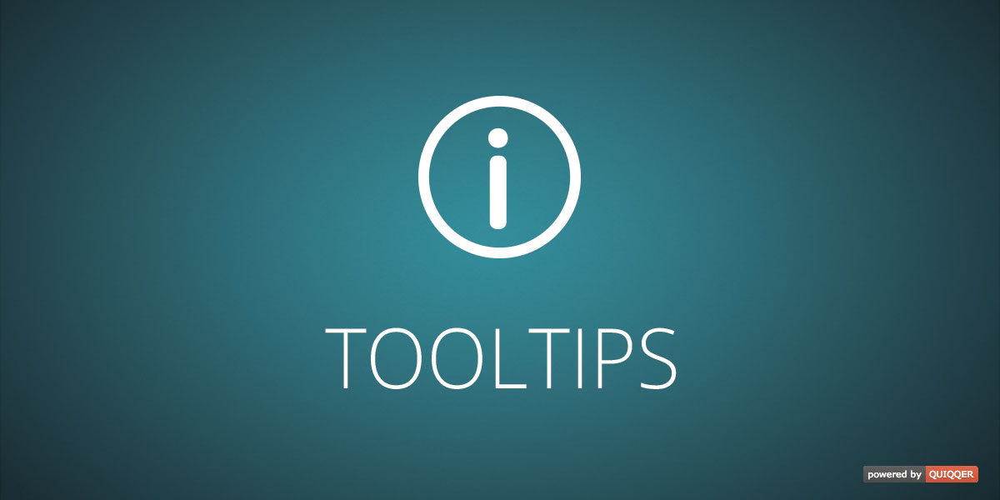

Tooltips
========

QUIQQER Tooltips based on [html5tooltipsjs](https://github.com/ytiurin/html5tooltipsjs)


Package Name:

    quiqqer/tooltips


Features
--------

- Tooltips based on [html5tooltipsjs](https://github.com/ytiurin/html5tooltipsjs)
- highly customizable (style/design, contents, animations, ...)
- usable via simple HTML-attributes or JavaScript-functions


Installation
------------

The package name is: quiqqer/tooltips


Contribute
----------

- Issue Tracker: https://dev.quiqqer.com/quiqqer/package-tooltips/issues
- Source Code: https://dev.quiqqer.com/quiqqer/package-tooltips


Support
-------

If you found any flaws, have any wishes or suggestions you can send an email
to [support@pcsg.de](mailto:support@pcsg.de) to inform us about your concerns. 
We will try to respond to your request and forward it to the responsible developer.


License
-------

MIT


Usage
--------

```javascript

require(['package/quiqqer/tooltips/bin/html5tooltips'], function(html5tooltips) {
    html5tooltips({
        animateFunction: "spin",
        color          : "tangerine",
        stickTo        : "top",
        contentText    : "This is the tooltip's text",
        targetSelector : "#my-tooltip"
    });
});

```


```html
<div id="my-tooltip" data-tooltip="My Alt Text"></div>
```